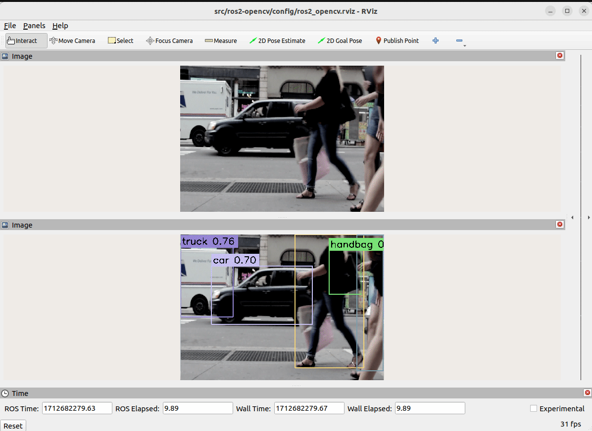

ROS 2 - OpenCV interoperability show case package
===================================================

`ROS 2` demo package to illustrate interoperability with `OpenCV`.</br>
It was tested with ROS 2 Humble but should also work with other distribution since no tweaks were added to make sure anyone can use it.</br>
This package provides two nodes:
- `CameraMockerNode`: loading a MPEG4 video with OpenCV and publishing its image in `image_provider` topic
- `DataProcessorNode`: susbscribing to `image_provider` topic and processing received image with OpenCV object detection then publishing processed image in `processed_image` topic

What to expect
===================================================
This package provides a launch file to automatically launch the two nodes described above, one publishing an image to `image_provider` and a second subscribing to this topic and as callback performs YOLOv5 object detection with OpenCV dnn then publishes the result in the `processed_image` topic.</br>
The animation below illustrate the expected behavior


How to use
===================================================
Go into your ROS2 workspace
```
cd ~/ros2_ws/src
```
Clone the repository
```
git clone https://github.com/BBO-repo/ros2-opencv.git
```
Return to your workspace folder and rebuild your workspace
```
cd ~/ros2_ws
colcon build --symlink-install
```
Source your `install/setup.bash`
```
source install/setup.bash
```
Launch the package launch file
```
ros2 launch src/ros2-opencv/launch/ros2-opencv.launch.xml rviz_config:=src/ros2-opencv/config/ros2_opencv.rviz yolov5_file_path:=src/ros2-opencv/assets/yolov5s.onnx  video_path:=src/ros2-opencv/assets/street-walk.mp4
```
